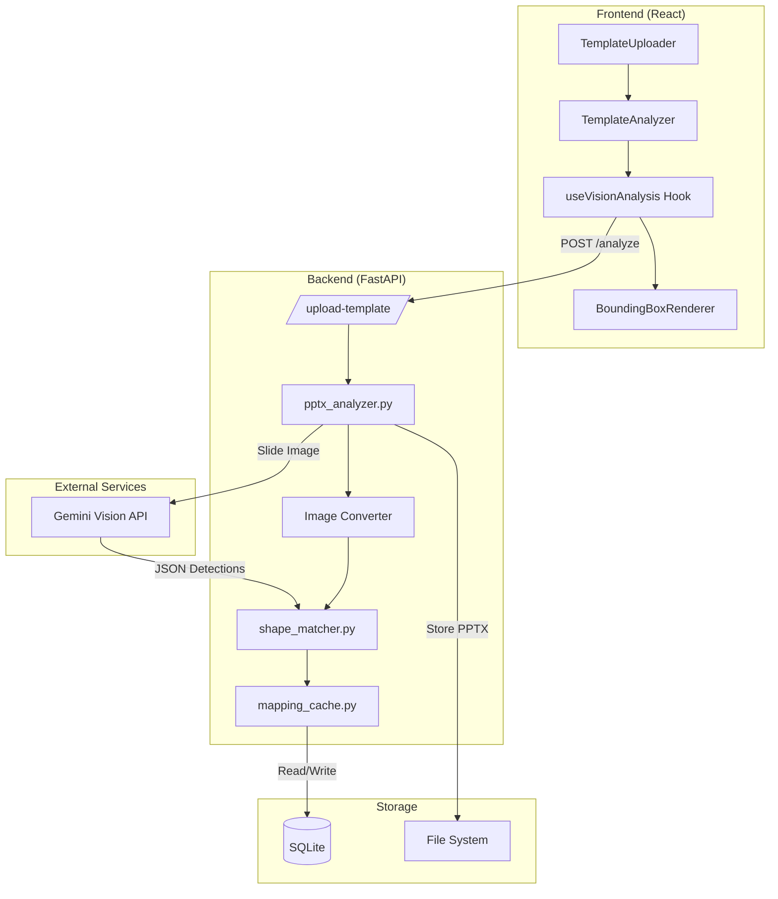

# Design Document: Template Auto-Mapping

## Overview

Este documento describe el diseño técnico del sistema de Auto-Mapping de Templates, que permite detectar automáticamente los placeholders y elementos de diseño en archivos PPTX corporativos usando Gemini Vision. El sistema elimina la configuración manual al analizar visualmente los templates y vincular las detecciones con los objetos reales del XML de PowerPoint.

El diseño se integra con la arquitectura existente:
- **Frontend**: React con hooks personalizados (`useVisionAnalysis`)
- **Backend**: FastAPI + python-pptx para manipulación de PPTX
- **IA**: Gemini 1.5 Flash para análisis visual, MiniMax para generación de contenido
- **Persistencia**: SQLite para caché de mappings

## Architecture



## Components and Interfaces

### Frontend Components

#### useVisionAnalysis Hook
```typescript
interface VisionElement {
  id: string;
  type: 'TITLE' | 'SUBTITLE' | 'BODY' | 'FOOTER' | 'IMAGE_HOLDER' | 'CHART_AREA' | 'UNKNOWN';
  coordinates: {
    top: number;    // 0-1000 normalized
    left: number;   // 0-1000 normalized
    width: number;  // 0-1000 normalized
    height: number; // 0-1000 normalized
  };
  style: {
    color: string;
    align: 'left' | 'center' | 'right';
    backgroundColor?: string;
  };
  confidence: number;
  shapeId?: number;  // Vinculado después del matching
}

interface UseVisionAnalysisReturn {
  elements: VisionElement[];
  isAnalyzing: boolean;
  isCached: boolean;
  error: string | null;
  analyzeTemplate: (file: File) => Promise<VisionElement[]>;
  updateElementType: (elementId: string, newType: string) => void;
}
```

#### TemplateAnalyzer Component (Enhanced)
```typescript
interface TemplateAnalyzerProps {
  file: File;
  imageUri: string;
  onAnalysisComplete: (mapping: TemplateMapping) => void;
  onError: (error: string) => void;
}

interface TemplateMapping {
  templateHash: string;
  elements: VisionElement[];
  shapeMapping: Record<string, number>;  // type -> shape_id
  analyzedAt: string;
  source: 'vision' | 'cache' | 'manual';
}
```

### Backend Modules

#### shape_matcher.py
```python
class ShapeMatcher:
    """Vincula detecciones de Gemini con shapes reales del PPTX"""
    
    def __init__(self, slide_width: int, slide_height: int):
        self.slide_width = slide_width
        self.slide_height = slide_height
        self.MATCH_THRESHOLD = 0.10  # 10% del ancho del slide
    
    def normalize_to_emu(self, coord: int, dimension: int) -> int:
        """Convierte coordenada normalizada (0-1000) a EMUs"""
        return int((coord / 1000) * dimension)
    
    def calculate_distance(self, shape, detection: dict) -> float:
        """Calcula distancia entre shape y detección"""
        target_left = self.normalize_to_emu(detection['left'], self.slide_width)
        target_top = self.normalize_to_emu(detection['top'], self.slide_height)
        return abs(shape.left - target_left) + abs(shape.top - target_top)
    
    def match_detections_to_shapes(
        self, 
        shapes: list, 
        detections: list[dict]
    ) -> dict[str, int]:
        """Genera mapping de tipo de contenido a shape_id"""
        pass

    def classify_by_geometry(self, shape) -> str:
        """Clasifica shape por posición/tamaño cuando no hay metadata"""
        pass
```

#### mapping_cache.py
```python
class MappingCache:
    """Gestiona caché de mappings en SQLite"""
    
    def __init__(self, db_path: str = 'presentations.db'):
        self.db_path = db_path
        self._init_tables()
    
    def generate_template_hash(self, pptx_bytes: bytes) -> str:
        """Genera hash único del archivo PPTX"""
        pass
    
    def get_cached_mapping(self, template_hash: str) -> Optional[dict]:
        """Recupera mapping desde caché si existe"""
        pass
    
    def save_mapping(self, template_hash: str, mapping: dict) -> None:
        """Guarda mapping en caché"""
        pass
    
    def update_element_type(
        self, 
        template_hash: str, 
        element_id: str, 
        new_type: str
    ) -> None:
        """Actualiza tipo de elemento (corrección manual)"""
        pass
```

### API Endpoints

```python
@app.post("/api/analyze-template")
async def analyze_template(file: UploadFile) -> AnalysisResponse:
    """
    Analiza template PPTX y retorna mapping de elementos.
    1. Verifica caché por hash
    2. Si no existe, convierte a imagen y llama a Gemini
    3. Vincula detecciones con shapes reales
    4. Guarda en caché y retorna
    """
    pass

@app.post("/api/update-mapping")
async def update_mapping(
    template_hash: str,
    element_id: str,
    new_type: str
) -> UpdateResponse:
    """Actualiza tipo de elemento en caché (corrección manual)"""
    pass
```

## Data Models

### Database Schema (SQLite)

```sql
-- Tabla de templates corporativos
CREATE TABLE corporate_templates (
    id TEXT PRIMARY KEY,
    hash TEXT UNIQUE NOT NULL,
    name TEXT,
    file_path TEXT,
    thumbnail_url TEXT,
    created_at TIMESTAMP DEFAULT CURRENT_TIMESTAMP
);

-- Tabla de mappings (la "memoria" de la IA)
CREATE TABLE template_mappings (
    id INTEGER PRIMARY KEY AUTOINCREMENT,
    template_hash TEXT NOT NULL,
    element_id TEXT NOT NULL,
    shape_id INTEGER,
    purpose TEXT NOT NULL,  -- TITLE, BODY, etc.
    coordinates TEXT,       -- JSON con top, left, width, height
    original_style TEXT,    -- JSON con font, color, etc.
    user_corrected BOOLEAN DEFAULT FALSE,
    created_at TIMESTAMP DEFAULT CURRENT_TIMESTAMP,
    updated_at TIMESTAMP DEFAULT CURRENT_TIMESTAMP,
    FOREIGN KEY (template_hash) REFERENCES corporate_templates(hash),
    UNIQUE(template_hash, element_id)
);

-- Índice para búsqueda rápida por hash
CREATE INDEX idx_mappings_hash ON template_mappings(template_hash);
```

### Gemini Vision Prompt

```
Actúa como un analizador experto de XML de PowerPoint.

Tarea: Analiza la imagen adjunta e identifica todos los contenedores de contenido (placeholders).

Instrucciones de Extracción:
1. Identifica el propósito de cada área: TITLE, SUBTITLE, BODY, FOOTER, IMAGE_HOLDER, o CHART_AREA
2. Devuelve las coordenadas en formato normalizado (0-1000) para top, left, width, height
3. Identifica atributos visuales: font_color (hex), text_alignment (left, center, right), y background_color
4. Estima el "Z-index" (orden de capas) si hay elementos superpuestos

Formato de salida: JSON puro. No agregues explicaciones.

{
  "slide_metadata": { "aspect_ratio": "16:9" },
  "elements": [
    {
      "id": "element_1",
      "type": "TITLE",
      "coordinates": {"top": 50, "left": 100, "width": 800, "height": 100},
      "style": {"color": "#2C3E50", "align": "center"},
      "confidence": 0.95
    }
  ]
}
```

## Correctness Properties

*A property is a characteristic or behavior that should hold true across all valid executions of a system—essentially, a formal statement about what the system should do. Properties serve as the bridge between human-readable specifications and machine-verifiable correctness guarantees.*

### Property 1: Coordinate Normalization Bounds

*For any* JSON response from Gemini Vision containing element coordinates, all coordinate values (top, left, width, height) SHALL be within the range [0, 1000] after parsing.

**Validates: Requirements 1.3**

### Property 2: Valid Element Classification

*For any* element detected by the Vision_Service, its type classification SHALL be exactly one of: TITLE, SUBTITLE, BODY, FOOTER, IMAGE_HOLDER, CHART_AREA, or UNKNOWN.

**Validates: Requirements 2.1**

### Property 3: Metadata Priority in Classification

*For any* PowerPoint shape with native placeholder_type metadata, the Shape_Matcher SHALL use that metadata as the primary classification source. *For any* shape without metadata, the classification SHALL be derived from geometric heuristics based on position and size.

**Validates: Requirements 2.2, 2.3**

### Property 4: User Correction Persistence

*For any* user correction to an element's classification, if the same template (identified by hash) is loaded again, the corrected classification SHALL be returned instead of the original AI classification.

**Validates: Requirements 2.5**

### Property 5: EMU Conversion Proportionality

*For any* normalized coordinate value `c` in range [0, 1000] and slide dimension `d` in EMUs, the converted EMU value SHALL equal `(c / 1000) * d`, maintaining proportional positioning.

**Validates: Requirements 3.2**

### Property 6: Optimal Shape Matching

*For any* set of shapes and Gemini detections:
1. The Shape_Matcher SHALL calculate distances between all shape-detection pairs
2. A shape SHALL be considered a match only if its distance is less than 10% of slide width
3. When multiple shapes match a detection, the shape with minimum distance SHALL be selected
4. The output SHALL be a dictionary mapping content types to their matched shape_ids

**Validates: Requirements 3.1, 3.3, 3.4, 3.5**

### Property 7: Template Hash Uniqueness and Cache Persistence

*For any* PPTX file:
1. The generated hash SHALL be deterministic (same file → same hash)
2. Different files SHALL produce different hashes (with high probability)
3. After first analysis, the mapping SHALL be stored in SQLite
4. Subsequent loads of the same file SHALL retrieve from cache without calling Gemini

**Validates: Requirements 4.1, 4.2**

### Property 8: Original File Preservation on Error

*For any* error that occurs during template analysis (conversion failure, API error, matching failure), the original PPTX file SHALL remain unmodified on disk.

**Validates: Requirements 6.4**

## Error Handling

### Error Categories and Responses

| Error Type | Detection | User Message | Recovery Action |
|------------|-----------|--------------|-----------------|
| Invalid PPTX | File parsing fails | "El archivo no es un PPTX válido" | Suggest re-upload |
| Conversion Failure | Image generation fails | "No se pudo procesar el template" | Offer manual mapping |
| Gemini API Error | HTTP 4xx/5xx | "Error de análisis visual" | Retry up to 2 times |
| Empty Detection | No elements found | "No se detectaron áreas" | Offer manual mapping |
| No Shape Match | All distances > threshold | "Estructura no estándar" | Log + manual mapping |

### Retry Strategy

```python
async def analyze_with_retry(image_base64: str, max_retries: int = 2) -> dict:
    for attempt in range(max_retries + 1):
        try:
            result = await call_gemini_vision(image_base64)
            if validate_response(result):
                return result
        except GeminiAPIError as e:
            if attempt == max_retries:
                raise AnalysisError(f"Gemini failed after {max_retries} retries")
            await asyncio.sleep(1 * (attempt + 1))  # Backoff
    raise AnalysisError("Invalid response from Gemini")
```

## Testing Strategy

### Unit Tests
- Coordinate normalization edge cases (0, 500, 1000, negative values)
- EMU conversion accuracy with known slide dimensions
- Hash generation determinism
- Classification type validation

### Property-Based Tests (fast-check / Hypothesis)
- **Property 1**: Generate random coordinate JSONs, verify bounds
- **Property 2**: Generate random elements, verify classification enum
- **Property 5**: Generate random coordinates and dimensions, verify conversion formula
- **Property 6**: Generate random shape/detection sets, verify matching algorithm
- **Property 7**: Generate random PPTX-like byte sequences, verify hash properties
- **Property 8**: Simulate errors during analysis, verify file unchanged

### Integration Tests
- Full flow: upload → analyze → cache → reload
- Manual correction persistence
- Gemini API mock responses
- Error recovery scenarios

### Test Configuration
- Property tests: minimum 100 iterations per property
- Use `fast-check` for JavaScript/TypeScript tests
- Use `hypothesis` for Python backend tests
- Tag format: **Feature: template-auto-mapping, Property N: [description]**
